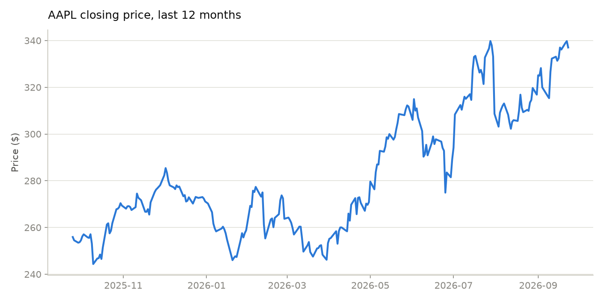
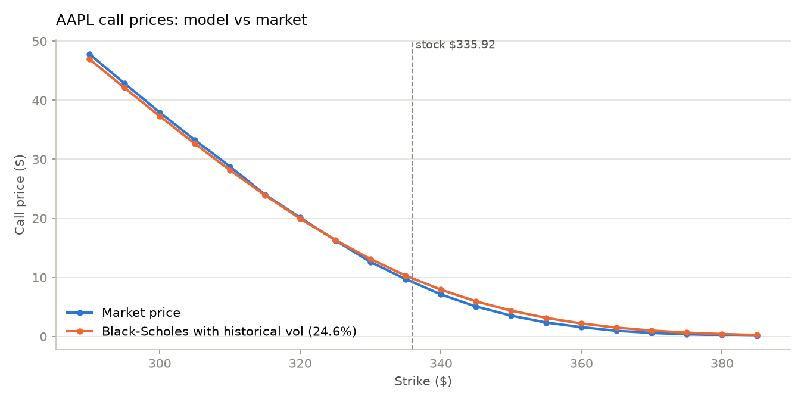
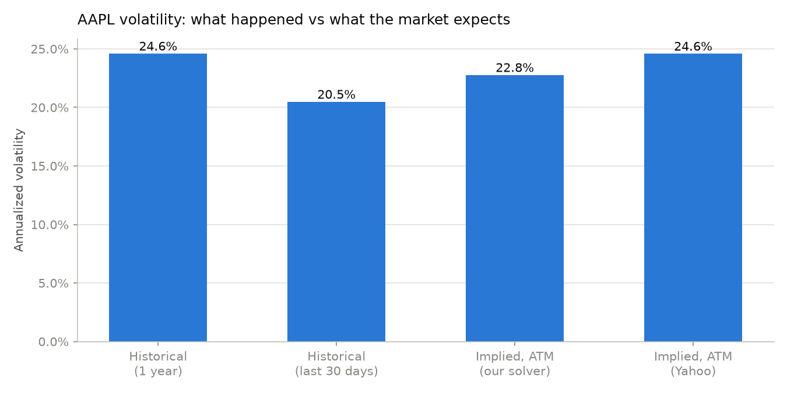
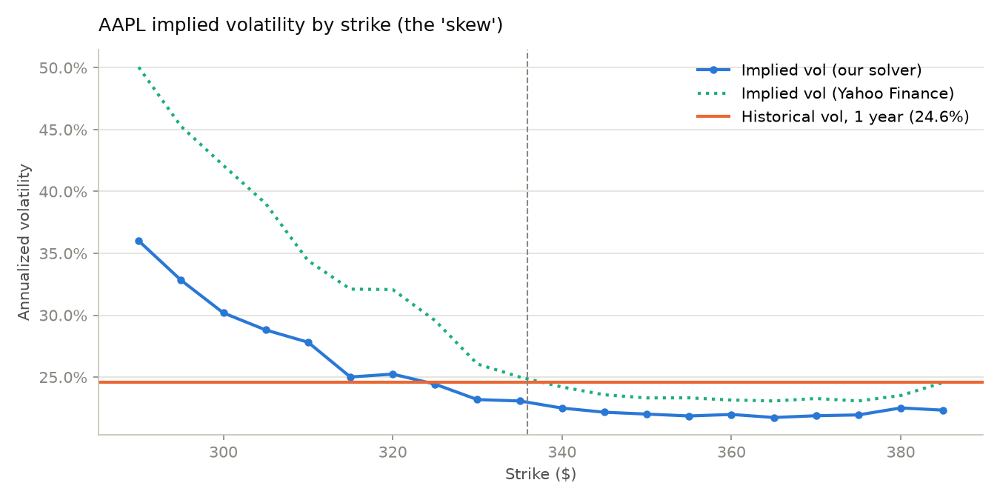

# Python Extension: Testing Black-Scholes Against Real Market Prices

The Excel calculator in this repo prices options from inputs I type in. This folder asks a harder question: **how well does the model match what traders actually pay?**

It ports the same Black-Scholes formulas to Python, feeds them real Apple (AAPL) stock and option data, and compares the model's prices to live market quotes.

## Key ideas (in plain English)

- **Volatility** measures how much a stock tends to move. It is the only Black-Scholes input you can't look up directly, so it's the one that matters most.
- **Historical volatility** looks backward: how much did the stock actually move over the past year?
- **Implied volatility** looks forward: working the formula in reverse from the market price tells you how much movement traders are *expecting*. If implied volatility is above historical, the market expects a bumpier ride than the past year; if it's below, a calmer one.
- **Volatility skew**: if Black-Scholes were a perfect description of markets, every strike price would imply the same volatility. In reality, it doesn't. Traders pay extra for protection against sharp drops, so lower strikes carry higher implied volatility.

## Results (AAPL, run on 24 Sep 2026)

| | |
|---|---|
| Stock price | $335.92 |
| Option expiry | 23 Oct 2026 (29 days) |
| Risk-free rate | 4.07% (13-week US T-bill) |
| Historical volatility, 1 year | **24.6%** |
| Historical volatility, last 30 days | 20.5% |
| Implied volatility, at-the-money | **22.8%** |

**What this shows:**

1. **The model is close, but not exact.** Using historical volatility, Black-Scholes priced the 20 most relevant call options within an average of **$0.52 per share** of the market.
2. **The market expects a calmer month than the past year.** At-the-money implied volatility (22.8%) is below the 1-year historical figure (24.6%), but above the last 30 days (20.5%). In other words, traders expect somewhat more movement than the recent quiet stretch, but less than the full past year, which included several large swings.
3. **A clear skew.** Implied volatility rises from about 22% for strikes above the stock price to 36% for the lowest strikes tested. This is the best-known way the real market departs from the model's assumption of a single, constant volatility.

Market data changes every day, so re-running the script will give different numbers.






## Files

| File | What it does |
|---|---|
| `black_scholes.py` | Pricing formulas and Greeks, ported one-to-one from `BlackScholes_Code.bas`, plus an implied-volatility solver. Run it directly to check it against the Excel example (call = 4.76, put = 0.81). |
| `analysis.py` | Downloads the data, runs the comparison, prints a results table, saves the charts to `plots/` and the table to `results.csv`. |

## How to run

```bash
pip install -r requirements.txt
python black_scholes.py     # check against the Excel calculator
python analysis.py          # AAPL by default
python analysis.py MSFT     # or any other ticker with listed options
```

## Method notes

- **Market price** is the midpoint between the bid and ask prices. The last trade price can be hours old for less active strikes.
- **Option selection:** the expiry closest to 30 days out, with strikes within ±15% of the stock price that have open interest.
- **Implied volatility** is found with Brent's method (`scipy.optimize.brentq`). There is no formula that runs Black-Scholes in reverse, so the solver searches for the volatility that reproduces the market price.
- **Cross-check:** Yahoo Finance publishes its own implied volatility figures. They follow the same shape but run a few points higher, especially for low strikes. Yahoo doesn't publish how it calculates them, so they're a rough sanity check only.
- **Simplifications:** European-style pricing (US stock options are American-style, meaning they can be exercised early) and no dividends (AAPL's dividend yield is under 0.5%). Both effects are small for 1-month calls on AAPL.
